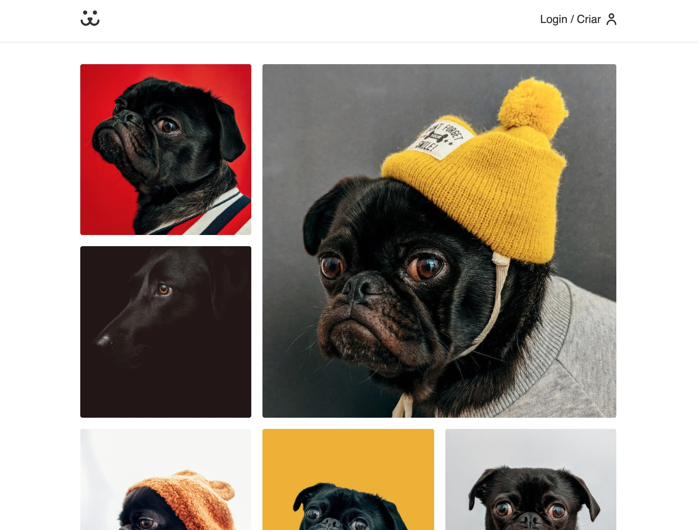

<h1 align="center">Dogs - Uma Rede Social para cães</h1>

## 📷 Demonstração





<br />

## 🚀 Tecnologias

✔️ React

Este projeto utiliza o [Create React App](https://github.com/facebook/create-react-app)
<br />
<br />

## 💻 Projeto

Dogs é uma rede social para donos de cachorros. É um projeto desenvolvimento durante o curso da Origamid de React Completo. Foi abordado temas como: autenticação, consumo de apis, rotas, rotas protegidas, animações, etc...

<br />
<br />

## Instalação

Você precisará ter apenas o [NodeJS](https://nodejs.org) instalado na sua máquina, e após isso, clonar este repositório:

```sh
  $ git clone https://github.com/PatrickSantosC/dogs
```

Depois disso acesse a pasta do projeto e instale as dependências executando o seguinte comando:

```sh
  $ yarn install # ou npm install
```

## Executando a aplicação

Execute o comando a baixo para inicializar o servidor de desenvolvimento:

```sh
  $ yarn start # ou npm start
```

## ✍️ Demo

https://dogs-redesocial.vercel.app/
